# Scale Sentry

[](https://github.com/ethan-kane-ops/scale-sentry/actions/workflows/ci.yml)
[](https://codecov.io/gh/ethan-kane-ops/scale-sentry)
[](https://github.com/ethan-kane-ops/scale-sentry/actions/workflows/release.yml)
[](https://opensource.org/licenses/Apache-2.0)
[](https://golangci-lint.run)
[](https://pkg.go.dev/github.com/ethan-kane-ops/scale-sentry)
[](https://kubernetes.io)
[](https://securityscorecards.dev/viewer/?uri=github.com/ethan-kane-ops/scale-sentry)
[](https://ethan-kane-ops.github.io/scale-sentry/)
[](https://artifacthub.io/packages/search?repo=scale-sentry)

<p align="center">
  
</p>

**Scale Sentry** validates Kubernetes auto-scaling behavior under load. It generates dynamic traffic to a target Deployment, tracks HPA scale-up latency against an SLA, and correlates HTTP errors with EndpointSlice updates to surface **cold-start traffic leakage**, errors served the instant a new pod is declared Ready.

It is a [kubebuilder](https://book.kubebuilder.io/) v4 controller built on `controller-runtime`. Workloads are validated declaratively through a `ScaleValidation` Custom Resource or through annotations on existing Deployments.

---

## Architecture

<picture>
  <source media="(prefers-color-scheme: dark)" srcset="docs/assets/architecture-dark.svg">
  
</picture>

The full run lifecycle, keyed to the Events the controller emits, is on the
[Events](https://ethan-kane-ops.github.io/scale-sentry/events/) page.

1. Controller reconciles a `ScaleValidation` CR, resolving its `targetRef` and computing dynamic load characteristics.
2. Two jobs are spawned: a Loadgen that drives traffic and an Observer that watches cluster state and scrapes cgroup metrics.
3. The Loadgen drives HTTP/1.1, HTTP/2, or gRPC traffic through the configured network path (`ClusterIP`, `Ingress`, or `Gateway`).
4. The Observer correlates the Loadgen request log with EndpointSlice updates and emits a structured verdict.
5. The verdict is written back to the CR's `status` subresource, including HPA latency, throttling, leakage diagnostics, and a pass / fail / warning band. Lifecycle Events narrate each transition for `kubectl describe`.

---

## Features

- **Custom Resource driven**, `validation.scale-sentry.ek.co/v1beta1` `ScaleValidation` resource stores test configuration, SLA targets, and execution history in the resource's `status` subresource.
- **Annotation bridge**, annotating an existing `Deployment` with `validation.scale-sentry.ek.co/enabled=true` provisions a shadow `ScaleValidation` automatically, no manifests required.
- **Three protocols**, drive HTTP/1.1, HTTP/2, or gRPC load, because validating an h2 or gRPC service with an h1 client measures the wrong thing. See [protocols](docs/protocols.md).
- **Open-loop load profiles**, `Constant`, `Poisson`, `Ramp`, `Step`, and `Spike` arrival models plus a warmup phase that keeps cold-start noise out of the latency histogram. See [load profiles](docs/load-profiles.md).
- **Endpoint targeting modes**, three target resolution strategies (`ServiceDefault`, `AutoDiscoverProbe`, `CustomPath`), three network paths (`ClusterIP`, `Ingress`, `Gateway`), and an optional `host` override to isolate scaling bottlenecks from edge bottlenecks.
- **Chaos disruption**, optionally terminates a healthy replica at peak load to test `terminationGracePeriodSeconds`, `preStop` hooks, and EndpointSlice propagation delays.
- **Lifecycle Events**, the controller narrates every run transition, so `kubectl describe scalevalidation` explains a failure without log spelunking. See [events](docs/events.md).
- **Clean teardown**, deleting a CR mid-run terminates its loadgen and observer Jobs via finalizer instead of leaving them burning traffic.
- **TLS-aware loadgen**, custom CA bundles from a ConfigMap or opt-in `insecureSkipVerify` for self-signed edges.
- **Diagnostic suite**:
  - **Readiness lag analyzer**, measures `PodRunning` → `PodReady` delta to detect sparse probe sampling.
  - **TCP / TLS handshake tester**, short-lived versus persistent connection pools.
  - **cgroup throttle watcher**, scrapes `nr_throttled` / `nr_periods` via Kubelet cAdvisor to flag CFS quota throttling.
  - **DNS + PDB auditor**, flags `ndots:5` resolver pressure and missing `PodDisruptionBudget`s.

---

## Custom Resource

```yaml
apiVersion: validation.scale-sentry.ek.co/v1beta1
kind: ScaleValidation
metadata:
  name: billing-service-validation
  namespace: production
spec:
  targetRef:
    apiVersion: apps/v1
    kind: Deployment
    name: billing-service

  sla: 90s

  target:
    mode: AutoDiscoverProbe    # ServiceDefault | AutoDiscoverProbe | CustomPath
    port: 8080
    networkPath: Gateway       # ClusterIP | Ingress | Gateway
    host: billing.example.com  # optional Host override for edge routing
    protocol: HTTP2            # HTTP1 | HTTP2 | GRPC

  load:
    baseRps: 150
    warmupDuration: 15s
    profile:
      pattern: Ramp            # Constant | Poisson | Ramp | Step | Spike
      endRps: 600
      rampDuration: 2m

  disruption:
    injectPodDeletion: true
    minReplicasForChaos: 2
    triggerDelay: 30s
```

More shapes (Poisson arrivals, gRPC, TLS, spike windows) live in
[`config/samples/`](./config/samples/); the full field reference is in the
[docs](https://ethan-kane-ops.github.io/scale-sentry/configuration/).

---

## Install

Install via OCI Helm chart from GHCR:

```bash
helm install scale-sentry \
  oci://ghcr.io/ethan-kane-ops/charts/scale-sentry \
  --namespace scale-sentry --create-namespace
```

Without `--version` this resolves the latest released chart; add
`--version X.Y.Z` (matching a [release](https://github.com/ethan-kane-ops/scale-sentry/releases))
to pin for reproducible installs.

Annotate any Deployment to opt into shadow validation:

```bash
kubectl annotate deployment/payment-service \
  validation.scale-sentry.ek.co/enabled=true \
  validation.scale-sentry.ek.co/sla=90s \
  validation.scale-sentry.ek.co/base-rps=150 \
  validation.scale-sentry.ek.co/port=8080
```

Available container images:

- `ghcr.io/ethan-kane-ops/scale-sentry`, controller
- `ghcr.io/ethan-kane-ops/scale-sentry-loadgen`, load generator job
- `ghcr.io/ethan-kane-ops/scale-sentry-observer`, observer job

All images are multi-arch (`linux/amd64`, `linux/arm64`).

### Verifying signatures

Every released image and the OCI chart are signed with [cosign](https://docs.sigstore.dev/)
keyless signing. The signing identity is the GitHub Actions OIDC token bound to
this repository's release workflow, so there are no keys to distribute. Verify
provenance before installing:

```bash
cosign verify ghcr.io/ethan-kane-ops/scale-sentry:v0.3.0 \
  --certificate-identity-regexp 'https://github.com/ethan-kane-ops/scale-sentry/.+' \
  --certificate-oidc-issuer https://token.actions.githubusercontent.com
```

The same command verifies the loadgen and observer images, and the chart at
`ghcr.io/ethan-kane-ops/charts/scale-sentry`.

Each image and the chart also carry a [SLSA build provenance](https://slsa.dev/)
attestation and an SBOM, published to the registry by the release workflow.
Verify the provenance with the GitHub CLI:

```bash
gh attestation verify oci://ghcr.io/ethan-kane-ops/scale-sentry:v0.3.0 \
  --repo ethan-kane-ops/scale-sentry
```

### High availability

The controller uses `controller-runtime` leader election (a
`coordination.k8s.io/Lease` in the release namespace), so it is safe to run more
than one replica. Only the leader reconciles; standbys idle until the lease
expires. Enable HA by raising the replica count:

```bash
helm upgrade --install scale-sentry oci://ghcr.io/ethan-kane-ops/charts/scale-sentry \
  --set controller.replicaCount=2
```

With `replicaCount > 1` the chart also renders a `PodDisruptionBudget`
(`minAvailable: 1`) and zone `topologySpreadConstraints`.

Tradeoff: HA adds one Lease object and a brief reconcile gap on failover. When
the leader pod dies, a standby acquires the lease within the renew window
(~15s default) before resuming. A single replica is fine for non-prod; set
`--leader-elect=false` (or `controller.leaderElect=false`) for local
single-node dev to skip the Lease entirely.

---

## Observability

The controller exposes Prometheus metrics on `:8080/metrics`. Stock
controller-runtime reconciler metrics (`controller_runtime_reconcile_*`,
`workqueue_*`) ship alongside the scale-sentry custom collectors:

| Metric | Type | Labels | Purpose |
|---|---|---|---|
| `scale_sentry_runs_total` | counter | `verdict=pass\|warn\|fail\|unknown` | Terminal-run verdict distribution |
| `scale_sentry_run_duration_seconds` | histogram | (none) | Wall-clock duration of a finished run |
| `scale_sentry_hpa_react_seconds` | histogram | (none) | First HPA scale-up reaction latency |
| `scale_sentry_diagnostic_alerts_total` | counter | `alert`, `severity` | Findings emitted by the analyzer pipeline |

To wire prometheus-operator scraping, set both gates in the chart:

```bash
helm upgrade --install scale-sentry oci://ghcr.io/ethan-kane-ops/charts/scale-sentry \
  --set metrics.service.enabled=true \
  --set metrics.serviceMonitor.enabled=true
```

The `metrics.service` block enables a ClusterIP fronting `:8080`; the
`metrics.serviceMonitor` block adds a `monitoring.coreos.com/v1`
ServiceMonitor pointing at it. Both default to off so the chart works on
clusters without prometheus-operator installed; raw `curl :8080/metrics`
still works without either gate.

A starter Grafana dashboard ships at
[`dashboards/scale-sentry.json`](dashboards/scale-sentry.json), import it
via Grafana's `+ -> Import` flow.

---

## Local Development

### Prerequisites

- Go ≥ 1.26 (toolchain pin in `go.mod`)
- [mise](https://mise.jdx.dev/installing-mise.html), runtime + tool manager
- [just](https://just.systems/man/en/), task runner (provisioned by `mise install`)
- A local Kubernetes cluster, [Kind](https://kind.sigs.k8s.io/) or [Minikube](https://minikube.sigs.k8s.io/)

### Bring up a dev cluster

```bash
mise install              # provisions Go, kubectl, helm, kind, just, kubeconform
just dev-up               # creates Kind cluster, builds + loads images, installs the chart
```

Apply a sample CR:

```bash
kubectl apply -f config/samples/targets/podinfo.yaml
kubectl apply -f config/samples/scalevalidation-servicedefault.yaml
```

Tear down:

```bash
just dev-down
```

### Common tasks

| Command                | Purpose                                                 |
|------------------------|---------------------------------------------------------|
| `just check`           | tidy + lint + unit tests, required before every commit |
| `just test-integration`| envtest suite (downloads apiserver + etcd assets)       |
| `just test-e2e`        | full verdict E2E in Kind                                |
| `just generate`        | regenerate `zz_generated.deepcopy.go`                   |
| `just manifests`       | regenerate CRD + RBAC YAML from kubebuilder markers     |

Run `just generate && just manifests` after any change to `api/v1beta1/*_types.go`.

---

## Contributing

See [CONTRIBUTING.md](./CONTRIBUTING.md) for development setup, coding guidelines, and the pull request workflow. Bug reports and feature requests go through the [issue templates](./.github/ISSUE_TEMPLATE/).

## Security

Vulnerabilities should be reported privately via [GitHub Security Advisory](https://github.com/ethan-kane-ops/scale-sentry/security/advisories/new). See [SECURITY.md](./SECURITY.md) for the disclosure policy.

## License

Apache License 2.0. See [LICENSE](./LICENSE).
