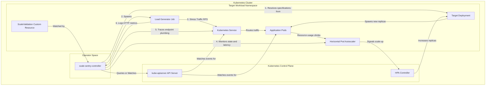

# Scale Sentry 🛡️

[](https://opensource.org/licenses/Apache-2.0)
[](https://goreportcard.com/report/github.com/ethan-kane-ops/scale-sentry)
[](https://kubernetes.io)

**Scale Sentry** is an open-source, highly-differentiated Kubernetes custom controller and validation engine built to actively load-test and validate application auto-scaling behavior and traffic resilience under sudden load spikes.

Unlike traditional disconnected load-generation tools, Scale Sentry bridges the gap between synthetic traffic and low-level cluster state. It calculates tailored target traffic volumes dynamically based on pod resources requests, stress-tests auto-discovered readiness endpoints, tracks HorizontalPodAutoscaler (HPA) reaction latency against configurable SLAs, and correlates high-frequency HTTP request logs with Service Endpoints updates to capture and diagnose **"cold-start traffic leakage"** (HTTP errors served immediately after a new pod is declared Ready).

---

## 🏗️ Architecture



---

## 🌟 Core Features

1. **First-Class CRD Controller:** Reconciles the `ScaleValidation` Custom Resource (`validation.scale-sentry.ek.co/v1alpha1`), storing test configurations, SLA targets, and keeping execution history directly in the resource's `status` subresource.
2. **Dynamic Annotation-to-CRD Bridge:** Reconciles raw annotated `Deployments` (using `scale-sentry.ek.co/validate: "true"`), automatically provisioning shadow `ScaleValidation` CRDs to ensure instant, zero-config onboarding for platform teams.
3. **Advanced Endpoint Targeting & Dual Routes:** Resolves target paths dynamically (`ServiceDefault`, `AutoDiscoverProbe` readiness paths, or explicit `CustomPath` routes). Supports testing distinct network routing paths—direct internal `ClusterIP` routing or external edge `Ingress` gateway paths—isolated to single flows per validation run.
4. **Chaos Disruption Engine (`spec.disruption`):** Simulates spot evictions, node drains, or replica shuffling by terminating a healthy replica pod at peak stress, testing application graceful shutdown capability, `terminationGracePeriodSeconds` behavior, and EndpointSlice propagation delays.
5. **Deep Systems-Diagnostic Suite:**
   * **Readiness Probe Sampling Lag Analyzer:** Tracks the exact time delta between `PodRunning` (physical startup) and `PodReady` (probe success) to detect inefficient sparse sampling frequencies.
   * **TCP Keep-Alive / Handshake Tester:** Runs persistent versus short-lived request pools to evaluate connection establishment and TLS handshake latency overhead.
   * **cgroup CPU Throttling Watcher:** Monitors `/sys/fs/cgroup/cpu.stat` on target containers during peak stress to flag CFS quota throttling that degrades application latency.
   * **Static DNS & PDB Compliance Auditor:** Alerts if the default K8s `ndots:5` resolver search path is overwhelming CoreDNS, and flags missing `PodDisruptionBudgets` (PDBs).

---

## 📄 Custom Resource Schema

Define validation runs declaratively:

```yaml
apiVersion: validation.scale-sentry.ek.co/v1alpha1
kind: ScaleValidation
metadata:
  name: billing-service-validation
  namespace: production
spec:
  # Target workload to stress and validate
  targetRef:
    apiVersion: apps/v1
    kind: Deployment
    name: billing-service

  # Maximum allowed time for HPA scale-up and pod readiness
  sla: 90s

  # Where to send the stress traffic
  target:
    mode: AutoDiscoverProbe # Options: ServiceDefault | AutoDiscoverProbe | CustomPath
    customPath: "/api/v1/checkout" # Used if mode is CustomPath
    port: 8080
    # Network routing pathway. Run separately to isolate bottlenecks
    networkPath: Ingress # Options: ClusterIP | Ingress

  # Load stress characteristics
  load:
    baseRps: 150
    concurrencyFactor: 50

  # Chaos and Graceful Termination settings
  disruption:
    injectPodDeletion: true
    minReplicasForChaos: 2
    triggerDelay: 30s
```

---

## 🚀 Quickstart

1. **Deploy the CRD schemas:**
   ```bash
   kubectl apply -f config/crd/bases/
   ```
2. **Deploy the Controller:**
   ```bash
   helm upgrade --install scale-sentry ./charts/scale-sentry -n scale-sentry --create-namespace
   ```
3. **Trigger Validation via Annotations:**
   Annotate any deployment to activate auto-validation:
   ```bash
   kubectl annotate deployment/payment-service scale-sentry.ek.co/validate="true"
   kubectl annotate deployment/payment-service scale-sentry.ek.co/scale-up-sla="90s"
   ```

---

## 🛠️ Local Development

### Prerequisites

* Go 1.22+
* [mise](https://mise.jdx.dev/) (Runtime manager)
* [just](https://just.systems/) (Task executor)
* A local Kubernetes development cluster ([Kind](https://kind.sigs.k8s.io/) or [Minikube](https://minikube.sigs.k8s.io/))

### Get Started

1. Clone and install dependencies:
   ```bash
   mise install
   ```
2. Spin up a local Kind cluster and load schemas:
   ```bash
   kind create cluster --name scale-sentry
   just install-crds
   ```
3. Run the controller locally against your cluster:
   ```bash
   just run
   ```
4. Run code checkers before committing:
   ```bash
   just check # runs tidy, linter, and unit tests
   ```

---

## 📄 License

Distributed under the Apache License 2.0. See `LICENSE` for details.
