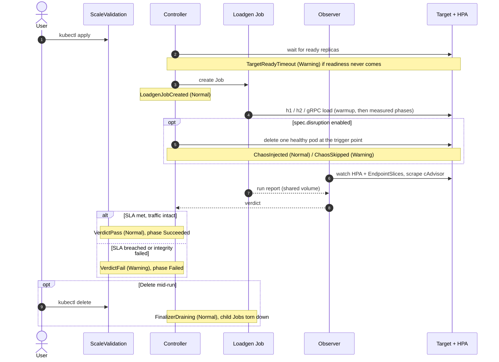

# Events

Scale Sentry emits Kubernetes Events on every meaningful state transition of a `ScaleValidation`. Events are the operator's primary UX for "what happened during my run, in the order it happened" without `kubectl describe` chasing or log scraping.

```bash
kubectl get events --field-selector involvedObject.name=my-validation,involvedObject.kind=ScaleValidation -w
```

## Lifecycle at a glance

Where each Event reason fires during a run:



Error paths not shown above fire on their own transitions: `LoadgenJobFailed` (pod exited non-zero), `LoadgenJobVanished` (Job deleted out from under the run), `TLSCABundleMissing` (referenced ConfigMap absent), and `RunErrored` (non-recoverable reconciler error). All four land the run in phase `Error`.

## Reason taxonomy

The controller writes exactly **eleven** reasons. They are stable strings; alerts and dashboards can match on them safely.

| Reason                  | Type    | When fired                                                                       |
|-------------------------|---------|----------------------------------------------------------------------------------|
| `LoadgenJobCreated`     | Normal  | The reconciler successfully created the loadgen Job for this CR.                 |
| `LoadgenJobFailed`      | Warning | The Job's pod terminated non-zero; the load run produced no usable result file.  |
| `LoadgenJobVanished`    | Warning | The Job referenced by status disappeared (manual delete, owner GC). Reset state. |
| `TargetReadyTimeout`    | Warning | The target Deployment did not reach ready state before SLA + grace expired.      |
| `TLSCABundleMissing`    | Warning | `spec.target.tls.caBundle` references a ConfigMap that does not exist.           |
| `VerdictPass`           | Normal  | SLA met, traffic integrity intact. Terminal success.                             |
| `VerdictFail`           | Warning | SLA breached or traffic-integrity check failed. Terminal failure.                |
| `RunErrored`            | Warning | The reconciler hit a non-recoverable error (e.g. API server unreachable).        |
| `FinalizerDraining`     | Normal  | A user-initiated delete is in-flight; the finalizer is tearing down child Jobs.  |
| `ChaosInjected`         | Normal  | `spec.disruption` deleted one healthy target pod at the trigger point.           |
| `ChaosSkipped`          | Warning | Disruption was configured but fewer than `minReplicasForChaos` replicas were healthy. |

## Why Events, not a CRD message field

Three reasons:

1. **Ordered timeline**: Events carry their own timestamp and `count` field, so a single transition that fires repeatedly is visible without polluting `status.message` with a string that tells you only the latest line.
2. **Selector-friendly**: `kubectl get events --field-selector involvedObject.uid=...` is built in; replicating that on a CRD-level field would require custom tooling.
3. **Audit-friendly**: kube-state-metrics and the audit log both index Events by Reason, so a downstream alert like "no VerdictPass in 24h" is one PromQL query.

## What is NOT emitted as an Event

- Per-request loadgen output. Volume is too high; the run-summary JSON in the loadgen pod logs is the right channel.
- Reconcile-loop chatter. Only state transitions emit events; idempotent reconciliations are silent.
- Analysis findings. Diagnostics from the analyzers land in `status.diagnostics`, not as Events; an alert can match on the `VerdictFail` reason and inspect status for detail.

## Wiring at startup

The controller takes its `record.EventRecorder` from `mgr.GetEventRecorderFor("scale-sentry")`. The `events.v1` API is intentionally **not** used: its required `action` and `related` fields do not fit the single-line reason UX, no `FakeRecorder` exists for it yet, and the established operators (cert-manager, karpenter) made the same call.

Operators running scale-sentry with a custom manager wire-up should reuse the same legacy recorder rather than chasing the deprecation; see `cmd/scale-sentry/controller.go` for the canonical setup.
