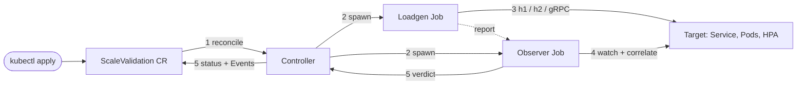

# Scale Sentry

**Scale Sentry** validates Kubernetes auto-scaling behavior under load. It generates dynamic traffic to a target Deployment, tracks HPA scale-up latency against an SLA, and correlates HTTP errors with EndpointSlice updates to surface **cold-start traffic leakage**: errors served the instant a new pod is declared Ready.

It is a [kubebuilder](https://book.kubebuilder.io/) v4 controller built on `controller-runtime`. Workloads are validated declaratively through a `ScaleValidation` Custom Resource or through annotations on existing Deployments.

## Architecture

The full run lifecycle, keyed to the Events the controller emits, is on the [Events](events.md) page.

1. Controller reconciles a `ScaleValidation` CR, resolving its `targetRef` and computing dynamic load characteristics.
2. Two jobs are spawned: a Loadgen that drives traffic and an Observer that watches cluster state and scrapes cgroup metrics.
3. The Loadgen drives HTTP/1.1, HTTP/2, or gRPC traffic through the configured network path (`ClusterIP`, `Ingress`, or `Gateway`).
4. The Observer correlates the Loadgen request log with EndpointSlice updates and emits a structured verdict.
5. The verdict is written back to the CR's `status` subresource, including HPA latency, throttling, leakage diagnostics, and a pass / fail / warning band. Lifecycle Events narrate each transition for `kubectl describe`.

## Features

- **Custom Resource driven**: the `validation.scale-sentry.ek.co/v1beta1` `ScaleValidation` resource stores test configuration, SLA targets, and execution history in the resource's `status` subresource.
- **Annotation bridge**: annotating an existing `Deployment` with `validation.scale-sentry.ek.co/enabled=true` provisions a shadow `ScaleValidation` automatically, no manifests required.
- **Three protocols**: drive HTTP/1.1, HTTP/2, or gRPC load, because validating an h2 or gRPC service with an h1 client measures the wrong thing. See [Protocols](protocols.md).
- **Open-loop load profiles**: `Constant`, `Poisson`, `Ramp`, `Step`, and `Spike` arrival models plus a warmup phase that keeps cold-start noise out of the latency histogram. See [Load Profiles](load-profiles.md).
- **Endpoint targeting modes**: three target resolution strategies (`ServiceDefault`, `AutoDiscoverProbe`, `CustomPath`), three network paths (`ClusterIP`, `Ingress`, `Gateway`), and an optional `host` override to isolate scaling bottlenecks from edge bottlenecks.
- **Chaos disruption**: optionally terminates a healthy replica at peak load to test `terminationGracePeriodSeconds`, `preStop` hooks, and EndpointSlice propagation delays.
- **Lifecycle Events**: the controller narrates every run transition, so `kubectl describe scalevalidation` explains a failure without log spelunking. See [Events](events.md).
- **Clean teardown**: deleting a CR mid-run terminates its loadgen and observer Jobs via finalizer instead of leaving them burning traffic.
- **TLS-aware loadgen**: custom CA bundles from a ConfigMap or opt-in `insecureSkipVerify` for self-signed edges.
- **Diagnostic suite**:
    - **Readiness lag analyzer**: measures `PodRunning` to `PodReady` delta to detect sparse probe sampling.
    - **TCP / TLS handshake tester**: short-lived versus persistent connection pools.
    - **cgroup throttle watcher**: scrapes `nr_throttled` / `nr_periods` via Kubelet cAdvisor to flag CFS quota throttling.
    - **DNS + PDB auditor**: flags `ndots:5` resolver pressure and missing `PodDisruptionBudget`s.

## Next steps

- [Getting Started](getting-started.md): install the chart and run a first validation.
- [Configuration](configuration.md): the full `ScaleValidation` spec.
- [API Reference](reference/api.md): generated CRD field reference.
